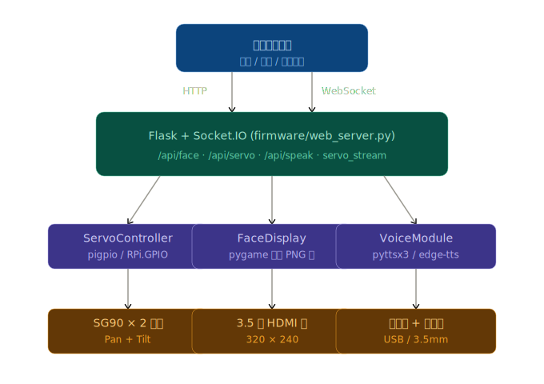

<!--
 * @Author: fbee3157 fbee3157@outlook.com
 * @Date: 2026-05-12 15:44:43
 * @LastEditors: fbee3157 fbee3157@outlook.com
 * @LastEditTime: 2026-05-12 17:07:47
 * @FilePath: \TARS-chat\README.md
 * @Description: 这是默认设置,请设置`customMade`, 打开koroFileHeader查看配置 进行设置: https://github.com/OBKoro1/koro1FileHeader/wiki/%E9%85%8D%E7%BD%AE
-->

# Stack-chan

[](https://github.com/TARS-chat/TARS-chat/actions/workflows/build.yml)
[](https://discord.gg/eGhd9adnBm)

[日本語](./README_ja.md) | [English](./README.md) | [中文](./README_cn.md)


TARS-chat 是一款由 Rust,Python 驱动、嵌入树莓派4B 的超可爱迷你桌面机器人。

*   **视频演示 (含英文字幕):** 
*   **官方话题标签:** [`#TARS` ]

## 主要功能

*   :neutral_face:     展示可爱表情
*   :smile:            丰富的情绪表达 (开心、生气、难过等)
*   :smiley_cat:       自定义面部表情
*   :eyes:             视线交互 (扫视、凝视、注视)
*   :speech_balloon:   语音/文字对话
*   :bulb:             支持 M5Stack 扩展单元 (Units)
*   :cyclone:          驱动串口(TTL)/PWM 舵机
*   :game_die:         开发属于你自己的应用程序

## 项目包含内容

本代码库包含了机器人的所有组成部分：

*   **firmware** : 固件源代码。
*   **case** : 机器人外壳的立体光刻 (STL) 模型文件。
*   **schematics** : 电路原理图和电路板布局数据。
*   **stls** : 3D打印结构图纸

## 安装指南

### 1. 组装电路板
*   请参考 [schematics/README.md](./schematics/README.md) 和 [case/README.md](./case/README.md)
*   或者：你可以购买预组装模块 (即将上线)

### 2. 烧录固件到开发板中
*   请参考 [firmware/README.md](./firmware/README.md)

## 开发贡献

面向贡献者的环境搭建和 Pull Request 规范，请参阅 [CONTRIBUTING.md](./CONTRIBUTING.md)。

典型的固件开发工作流：
```bash
cd firmware
npm run setup
npm run doctor
npm run test
npm run build
```

> **注意：** `web/flash` 和 `web/schematics` 下的网页资源是由 GitHub Actions 从 `gh-pages` 分支发布的。请将它们视为部署输出产物，而非手动维护的源文件。

## 路线规划

*   开发路线图: [docs/ROADMAP.md](./docs/ROADMAP.md)

## 架构图



## 参与贡献

**非常欢迎提出功能请求或报告 Bug！** 请前往 [issues](https://github.com/kemomi/TARS-chat/issues) 页面提交。

**想成为赞助者吗？** 这将是我的莫大荣幸。请访问我的 [赞助页面](https://github.com/sponsors/kemomi/)。

## 许可证

本代码库的资源均采用 Apache 2.0 许可证分发。
详见 [LICENSE](./LICENSE)。
