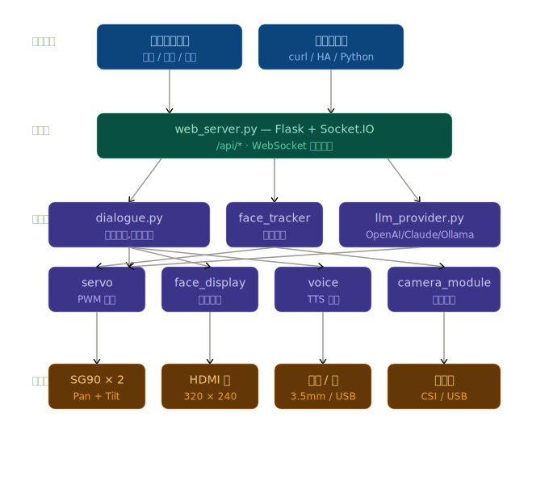

# TARS-chat

[](LICENSE)
[](https://discord.gg/eGhd9adnBm)

> 一款由 **Python** 驱动、嵌入 **树莓派 4B** 的超可爱迷你桌面机器人。
> 可显示表情、转动头部、对话交流,通过手机/浏览器远程控制。

[日本語](./README_ja.md) | [English](./README_en.md) | [中文](./README_cn.md)



---

## ✨ 功能特性

- 😄 **丰富表情**: 中性 / 开心 / 难过 / 生气 / 惊讶 / 困倦,支持自定义 PNG 帧序列
- 🎮 **远程摇杆**: 网页拖动实时控制 Pan/Tilt 二自由度云台 (WebSocket 低延迟)
- 🗣️ **语音对话**: 内置 TTS (离线 pyttsx3 / 在线 edge-tts),可扩展 STT
- 🧠 **LLM 大脑**: 支持 OpenAI / Anthropic / 本地 Ollama,对话时自动联动表情与动作
- 🌐 **跨平台控制**: 任意浏览器/手机访问,无需安装 App
- 🔧 **模块化设计**: 舵机、显示、Web、语音、LLM 解耦,容易二次开发
- 📦 **一键部署**: `bash scripts/install.sh` 全自动安装

## 🗂 仓库结构

```
TARS-chat/
├── firmware/          # 树莓派固件 (Python)
│   ├── main.py        # 入口
│   ├── src/           # 核心模块
│   ├── config.yaml    # 配置文件
│   ├── assets/faces/  # 表情资源 (PNG 序列)
│   └── requirements.txt
├── web/               # Web 控制台 (HTML + Socket.IO)
├── schematics/        # 电路接线与原理图
├── stls/              # 3D 打印 STL 文件清单
├── case/              # 外壳设计源文件
├── scripts/           # 安装/测试脚本
├── systemd/           # 开机自启服务
└── docs/              # 文档、图片
```

## 🚀 快速开始

### 硬件准备
1. 看 [`硬件BOM + 接线表 + ASCII 接线图`](./schematics/BOM+接线表+ASCII接线图.md) 准备元件清单并完成接线
2. 看 [`结构件清单`](./stls/结构件清单 + 打印参数.md) 打印 3D 结构件
3. 装配机器人

### 烧录固件
```bash
git clone https://github.com/kemomi/TARS-chat.git
cd TARS-chat
pip install requirements.txt #安装依赖和环境
bash scripts/install.sh  #启动脚本
```

详细步骤见 [`固件烧录`](./firmware/固件安装文档.md)。

### 开始使用
```bash
sudo systemctl enable --now tars-chat
```
浏览器打开 `http://<树莓派IP>:8080` 即可看到控制台。

## 🛠 开发工作流

```bash
cd firmware
source venv/bin/activate
python ../scripts/test_servo.py   # 舵机自检
python main.py                    # 前台调试
```

修改 `../firmware/src/` 下任意文件后自启:
```bash
sudo systemctl restart tars-chat
```

## 📡 通信协议

| 类型      | 路径              | 说明                         |
|-----------|-------------------|------------------------------|
| HTTP POST | `/api/face`       | `{expression:"happy"}`       |
| HTTP POST | `/api/servo`      | `{action:"set",pan:90,tilt:80}` 或 `nod`/`shake`/`center` |
| HTTP POST | `/api/speak`      | `{text:"你好"}`              |
| HTTP POST | `/api/chat`       | `{text:"今天天气如何"}` — LLM 对话 |
| HTTP POST | `/api/chat/reset` | 清空对话历史                  |
| HTTP GET  | `/api/status`     | 查询当前状态                 |
| WebSocket | `servo_stream`    | 实时摇杆推流 (低延迟)         |
| WebSocket | `dialogue_event`  | 多端对话同步                  |

详细字段见 [`docs/API.md`](./docs/API.md)。LLM 接入见 [`docs/LLM.md`](./docs/LLM.md)。

## 🗺 路线图

见 [`ROADMAP`](./ROADMAP.md)。

## 🤝 贡献

欢迎提 Issue 与 PR!参与方式见 [`CONTRIBUTING`](./CONTRIBUTING.md)。

## 📄 许可证

[Apache 2.0](./LICENSE)
